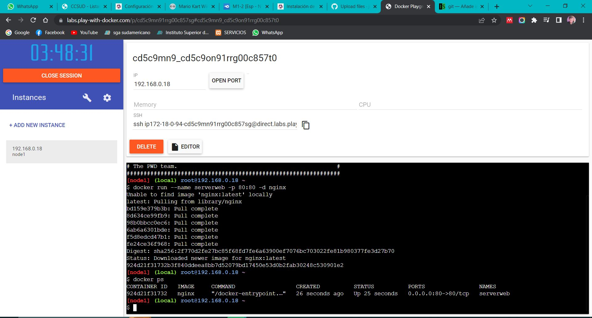

<h1># deberesTendencias</h1>
<h1>informes semanales para tendencias tecnologicas</h1>

<h2>1.Crear una cuenta en Docker Hub</h2>

<h2>2. Iniciar play with docker desde el navegador e iniciar sesion</h2>

<h2>4. click en añadir nueva instancia</h2>

<h2>6. En la pantalla consola añadir el contenedor con el comando "docker run --name serverweb -p 80:80 -d nginx" especificanco el puerto con el que se trabajará</h2>

<h2>8. Revisar el contenedor que esta corriendo con comando "docker ps"</h2>

<h2>9.obtener un archivo html desde un repositorio en github con el comando "wget" seguido del url del repositorio</h2>

<h2>10.se puede observar que se cargo correctamente</h2>

<h2>11.seguido se clona el repositorio con "git clone" seguido del url del html</h2>

<h2>12.se ingresa al directorio del html con "cd"</h2>

<h2>13.revisamos con un "ls" si esta el archivo html </h2>

<h2>14.se extrae el archivo html con el comando "docker cp index2.html serverweb/usr/share/nginx/html/index2.html</h2>

<h2>15.presionamos en el boton port para ingresar al puerto cargado anteriormente</h2>

<h2>16.Ingresamos el puerto utilizado en el contenedor</h2>

  

<h2>17. esta funcionando nginx y en la url se agrega un slash seguido del nombre del html al que vamos a ingresar </h2>

<h2>18. Se puede observar que la pagina web se cargo correctamente y se visualiza el html anteriormente cargado desde github </h2>

